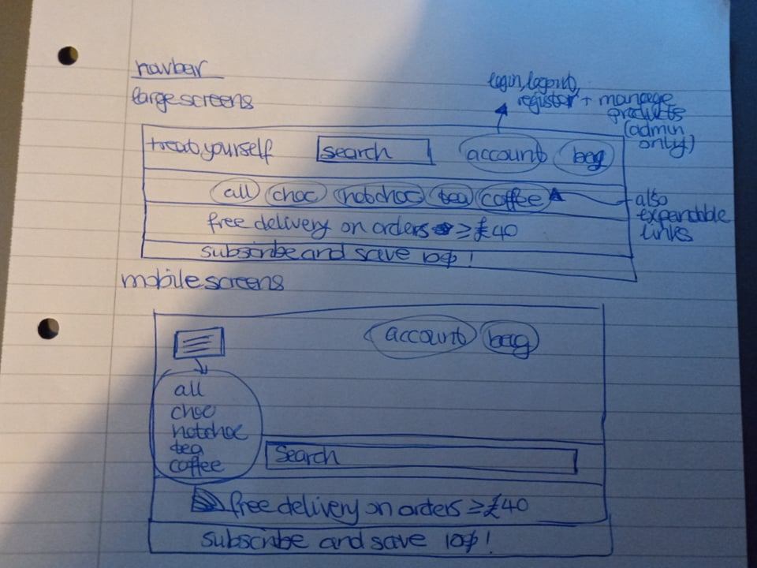
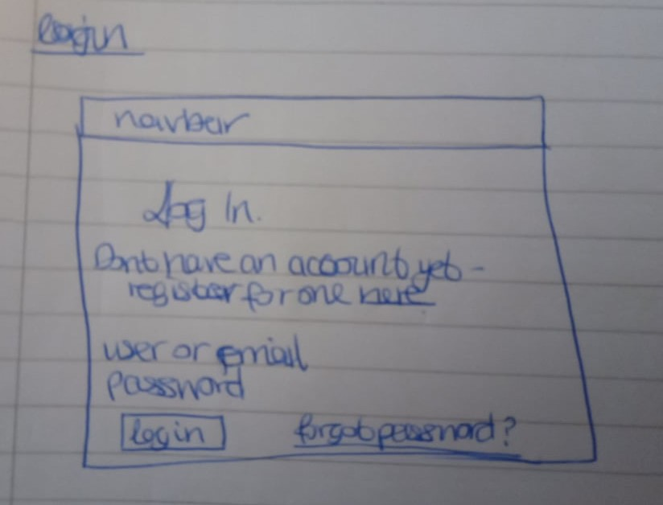
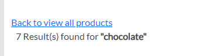
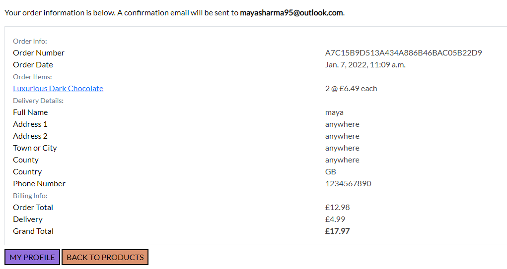

# Treat Yourself

[Link to live project.](.....)

This is a website for a site selling chocolate, hot chocolate, tea and coffee.  

It is aimed for those who are interested in purchasing any of the above, the site helps users pick the right products for them by having sorting options by price/ratings and also having different sections in the site for the 4 different categories of products.

## Table of Contents

* [UX](#ux)
  * [User Stories](#user-stories)
    * [First Time Visitor Goals](#first-time-visitor-goals)
    * [Returning Visitor Goals](#returning-visitor-goals)
    * [Frequent User Goals](#frequent-user-goals)
  * [Strategy](#strategy)
    * [Business Goals](#business-goals)
    * [User Goals](#user-goals)
  * [Scope](#scope)
  * [Structure](#structure)
  * [Skeleton](#skeleton)
   * [Wireframes Navbar](#wireframes-navbar)
   * [Wireframes Home](#wireframes-home)
   * [Wireframes Login](#wireframes-login)
   * [Wireframes Register](#wireframes-register)
   * [Wireframes Logout](#wireframes-logout)
   * [Wireframes Products](#wireframes-products)
   * [Wireframes Product Detail](#wireframes-product-detail)
   * [Wireframes Bag](#wireframes-bag)
   * [Wireframes Checkout](#wireframes-checkout)
   * [Wireframes Checkout Success](#wireframes-checkout-success)
   * [Wireframes Profile](#wireframes-profile)
   * [Wireframes Add Product](#wireframes-add-product)
   * [Wireframes Edit Product](#wireframes-edit-product)
   * [Wireframes Add Review](#wireframes-add-review)
   * [Wireframes Edit Review](#wireframes-edit-review)
   * [Wireframes Add Rating](#wireframes-add-rating)
   * [Wireframes Edit Rating](#wireframes-edit-rating)
   * [Wireframes Comments](#wireframes-comments)
  * [Surface](#surface)
    * [Colours](#colours)
    * [Imagery](#imagery)
* [Features](#features)
    * [Existing Features](#existing-features)
    * [Features Left to Implement](#features-left-to-inplement)
* [Technologies Used](#technologies-used)
* [Testing](#testing)
  * [Manual Testing](#manual-testing)
    * [Shopping Bag](#shopping-bag)
    * [Delivery Variable](#delivery-variable)
    * [Discounted Price](#discounted-price)
  * [Online Validation](#online-validation)
  * [Lighthouse Validation](#lighthouse-validation) 
  * [User Stories from the UX Section](#user-stories-from-the-ux-section)
* [Deployment](#deployment)
  * [Creation](#creation)
  * [Heroku](#heroku)
  * [Local Clone](#local-clone)
  * [Forking](#forking)
* [Credits](#credits)
  * [Code](#code)
  * [Content](#content)
  * [Media](#media)
  * [Acknowledgments](#acknowledgments)

## UX

### User Stories

#### First Time Visitor Goals

* As a first time user, I want to know the purpose of the site.

* As a first time user, I want to be able to see products that appeal to me by filtering on the 4 main categories of the site, the subcategories within the 4 main categories and also sorting by price or overall rating. I want to be able to quickly add a product to my basket from this page (default of 1 quantity and not on subscription).

* As a first time user, I want to be able to the specific details of a product I am interested in (description, price and rating) from here I want to be able to add products to my shopping basket.

* As a first time user, I want to be able read reviews of products made by other users.

* As a first time user I want to be able to search for a specific term (for the name or description of a product), on filtering or searching for a term I want to see the number of results displayed.

* As a first time user, I want to be able to see the total in my shopping basket at any given time.

* As a first time user, I want to be able to view my shopping basket and update the quantity of a product or remove it within the page.

* As a first time user, I want to be able to purchase products successfully (get taken to a page which confirms the order has been successful) and see these in my profile when logged in. 

#### Returning Visitor Goals

* As a returning user, I have similar needs of a first time user.

* As a returning user, I want to be able to register for an account, log in and log out.

* As a returning user, I want the site to save my default delivery information for easier checkout in the future (if I am registered to the site and logged in).

* As a returning user, I want to be able to rate products I have tried to help other users find good products.

* As a returning user, I want to be able to review products I have tried to help other users find good products.

#### Frequent User Goals

* As a frequent user, I have similar needs of a first time and returning user.

* As a frequent user, I want to subscribe so that I get my favourite products on a regular schedule and also save some money.

### Strategy

#### Business goals

* As a business owner, I want to help users find new products they may enjoy.

* As a business owner, I want to help users purchase products.

* As a business owner, I want to be able to manage the products (picture, price, description etc) that are displayed on the site and remove any that are not for sale anymore.

* As a business owner I want to be able to delete any product reviews that contain inappropriate text or are spam.

#### User Goals

* To find existing and new products they may like.

* To purchase any products as a one off or purchase on a subscription.

* To have the ability to view past orders I have made from my profile.

* To have the ability to rate and review products I have previously tried.

### Scope

Key features to be included based on user stories are:

* Responsive website on mobile, tablet and laptop size devices.

* There will be a consistent navigation bar across all pages showing the user links to home, products, the option to search the site, links to view products based on different categories or sorting options and their shopping bag. If the user is not logged in there will be links to register or login. If the user is logged in there will be links to logout and view their profile. If the user is logged in as an admin there will be a link to add a new product to the store.

* The home page will contain a selection of the products available on the site to entice users to view the products in more detail and hopefully make a purchase.

* The register page will allow users to create their own account for the site by entering a username, email address and password.

* The login page will allow registered users to login with their username or email and password.

* The logout page will be a check to confirm a user definitely wants to logout.

* The products page will show the users the products with some main details like price and rating.

* The product detail page will show the further details of the product like the description. 

* The shopping bag page will show what a user currently has in their basket and a link for them to checkout and complete their purchase.

* The checkout page will allow users to enter their delivery and billing information to complete the purchase, if they are logged in their default payment and delivery information will be automatically populated.

* The checkout success page will show users details of what they have ordered.

* The profile page will show a user's past orders and it will also allow then to update their default delivery information.

* The add product page will be available to admin only, this will allow them to enter a products name, description, picture and price.

* The edit product page will be similar to the add product page and will be available to admin only, the only difference is that this will auto populate with the products current information and allow the admin to update any details.

* The add review page will allow logged in users to add a review of a product.

* The edit review page will allow logged in users to edit one of their existing reviews.

* The add rating page will allow logged in users to add a rating of a product.

* The edit rating page will allow logged in users to edit one of their existing ratings.

### Structure

All pages of the website will have a consistent navigation bar. The home, login and register links will be available to users who aren't yet registered and/or logged into the site. All users regardless or registration or login status will be able to view all products, view product detail pages, add products to their shopping basket, view the basket  and make a purchase. Logged in users and admin (superusers) will be able to view their profile and also logout. Admin (superusers) will be able to edit and delete products, they will also be able to add new products to the store. Below the navbar there will also be a header with links to view all products (by price, rating or category) or one of the 4 main categories of products (chocolate, hot chocolate, tea and coffee), under these 4 main categories there will be subcategories as follows: Chocolate (white, milk, dark and all), hot chocolate (classic, nutty, other, all), tea (black, white, other, all) and coffee (dark roast, light roast, medium roast, all). This header will also be displayed on all pages of the site. Finally, there will be a banner showing the free delivery threshold to encourage users to order more products and a banner showing users that they can subscribe and save money.

The website will use Materializecss grids to make the layout responsive to different devices and screen sizes.

* The home page will contain a selection of the products available on the site to entice users to view the products in more detail and hopefully make a purchase. This will also contain a link to enter the store and view the specific products.

* The register page will allow users to create their own account for the site by entering a username, email address and password. This will also contain a link for registered users to login.

* The login page will allow registered users to login with their username or email and password. This will also contain a link for unregistered users to register an account and a link for users who are registered to reset their password if they forgot it.

* The logout page will be a check to confirm a user definitely wants to logout.

* The products page will contain the number of products available given a certain selection or search made by the user and below it the products with some main details like price and rating. There will also be quick links for the users to add 1 of any item to their shopping basket, this can be amended on the basket page. Additionally, admin will have quick links to edit or delete any products in the store.

* The product detail page will show the description of the product with the other variables like price and rating. From here users can select a one-off purchase and the quantity or they can subscribe to get their favourite product sent regularly to them. Users can also read any reviews made of a product on these pages and logged in users will have links to rate/review products, if the user has reviewed/rated the product previously they will be given information on how to edit/delete their rating/review. There will also be links for admin users to edit/delete a product from here. Admin users will also be able to delete any reviews on this page.

* The shopping bag page will show what a user currently has in their basket. If the user does not have any items they will be prompted to return to the products page to add some items to the bag. If the user does have items this will be displayed on the page and they will have the ability to update the quantity of any items or remove them from the bag if they changed their mind. If the user has some items a link to checkout will also be displayed and take the user to the checkout page.

* The checkout page will allow users to enter their delivery and billing information to complete the purchase, if they are logged in their default payment and delivery information will be automatically populated. If a user is logged in there will also be a default checked box if a user wants/needs to update any information on this page and save it to their profile, if a user if not registered or logged in there will be a prompt to login or register an account.

* The checkout success page will show users details of what they have ordered and text that they will have received an email confirming this. There will be a link back to the products and if they are logged in there will also be a link to view their profile.

* The profile page will show a user's past orders (and the option to add a previous product to their bag again of the same product type and quantity) and it will also allow then to update their default delivery information. The profile page will also list any products the user has rates/reviewed before with links to edit or delete these ratings/reviews should the user change their mind.

* The add product page will be available to admin only, this will allow them to enter a products name, description, picture and price. The ratings variables will not be shown here as this is derived based on user ratings in the database and not for admins to edit/delete, the default values for rating, totalrating and numberofratings variables will be 0 for all new products added.

* The edit product page will be similar to the add product page and will be available to admin only, the only difference is that this will auto populate with the products current information and allow the admin to update any details. The ratings variables will not be shown here as this is derived based on user ratings in the database and not for admins to edit/delete.

* The add review page will allow logged in users to add a review of a product. If a user has already reviewed this product they will be informed and prompted to edit their existing review.

* The edit review page will allow logged in users to edit one of their existing reviews.

* The add rating page will allow logged in users to add a rating of a product (options 1 through 5). If a user has already rated this product they will be informed and prompted to edit their rated review. This data will feed into the products model rating, totalrating and numberofratings variables.

* The edit rating page will allow logged in users to edit one of their existing ratings. This data will feed into the products model rating, totalrating and numberofratings variables.

### Skeleton

I used pen and paper to make the wireframes for this project. The website was designed to have 16 pages - Home, Login, Register, Logout, Products, Product detail, Bag, Checkout, Checkout success, Profile, Add product (admin only), Edit product (admin only), Add review, Edit review, Add rating and Edit rating. 

#### Wireframes Navbar

  

#### Wireframes Home

  

#### Wireframes Login

  

#### Wireframes Register

  

#### Wireframes Logout

  

#### Wireframes Products

  

#### Wireframes Product Detail

  

#### Wireframes Bag

  

#### Wireframes Checkout

  

#### Wireframes Checkout Success

  

#### Wireframes Profile

  

#### Wireframes Add Product 

  

#### Wireframes Edit Product

  

#### Wireframes Add Review 

  

#### Wireframes Edit Review

  

#### Wireframes Add Product 

  

#### Wireframes Edit Product

  

#### Wireframes Comments

Please note there are a few changes to the final site since the wireframes were made:

* On the profile page the my reviews and my ratings sections are only half width of the screen size on large screens, on smaller screens every section takes up the whole device width.

### Surface

#### Colours
I looked at popular sites selling these products including: [Hotel Chocolat](https://www.hotelchocolat.com/uk), [Thorntons](https://www.thorntons.co.uk/), [Whittard](https://www.whittard.co.uk/) and [T2 Tea](https://www.t2tea.com/en/uk/). I chose a main colour of purple (#9370DB) to represent a luxury brand for the site. The site [here](https://www.99colors.net/name/medium-purple) helped me find triad colours of orange (#DB9370) and green (#70DB93). General text for descriptions, prices etc of products uses dark grey (#424242).

#### Imagery
I chose a selection of the product images to show on the home screen to entice users to view the products in more detail and hopefully make a purchase. For each of the 4 categories I chose images to show these specific products (chocolate, hot chocolate, tea and coffee). Further information on this is given in the credits - media section of this readme.

## Features

### Existing Features

* The site is responsive on mobile, tablet and laptop size devices.

* The home page contains images of a selection of the products available on the site and a link to enter the store and view the specific products.

* The register page allows new users to register to the site with a username, email and password.

* The login page allows registered users to login with their username or email and password.

* The logout page allows logged in users to logout.

* The products page allows users to quickly see the products on the site with main details including price and rating. This page also allows users to quickly add 1 of any item to their shopping bag. Additionally, admin have quick links to edit or delete any products in the store from here.

* The product detail page allows users to see full information of a product including the description and any user reviews that have been made. From here users can select a one-off purchase and the quantity or they can subscribe to get their favourite product sent regularly to them. Logged in users have quick links to rate/review the product from this page, if the user has reviewed/rated the product previously they will be given information on how to edit/delete their rating/review. If a logged in user has created a review they are able to edit or delete it from this page. Admin also have quick links for admin users to edit/delete a product from here and also to delete any reviews on this page.

* The shopping bag page allows users to view what is currently in their basket and to update or delete any items from here. Users can only update the quantity of one-off purchases and not for subscriptions, this is on purpose. They can't add more than one subscription for the same product from either the product detail page or the bag. Also, users can only add 10 of any item at a time to their bag and they can't add more than this from either the product detail page or the bag. 

* The checkout page allows users to enter their delivery and billing information to complete the purchase.

* The checkout success page shows a user that their purchase was successful and lets them know that they will have received an email confirming this. There will be a link back to the products and if they are logged in there will also be a link to view their profile.

* The profile page allows users to view their past orders and the option to add a previous product to their bag again of the same product type and quantity. This page also allows users to see what products they have rated/reviewed and gives them quick links to edit or delete these ratings/reviews should the user change their mind. This page also allows users to view/update their default delivery information.

* The add product page allows admin users to add a new product to the store with name, category, description, price and image. The ratings variables will not be shown here as this is derived based on user ratings in the database and not for admins to edit/delete, the default values for rating, totalrating and numberofratings variables will be 0 for all new products added.

* The edit product page allows admin users to update a current product in the store. The ratings variables will not be shown here as this is derived based on user ratings in the database and not for admins to edit/delete.

* The add review page allows logged in users to add a review of a product. If a user has already reviewed this product they will be informed and prompted to edit their existing review.

* The edit review page allows logged in users to edit one of their existing reviews.

* The add rating page allows logged in users to add a rating of a product (options 1 through 5). If a user has already rated this product they will be informed and prompted to edit their rated review. This data will feed into the products model rating, totalrating and numberofratings variables.

* The edit rating page allows logged in users to edit one of their existing ratings. This data will feed into the products model rating, totalrating and numberofratings variables.

### Features Left to Implement

* The subscription functionality only works on the frontend and has not been set up to take regular (in this case monthly) payments from the users card, as this would require extra security steps and to save the users card details and billing information which is more complex than this course covers.

* It would be good to allow users to choose the frequency of their subscription (monthly, every 2 months etc).

* It would be good on the profile page to show the user all their active subscriptions and also include details on their next delivery date and give them the option to change this or pause/stop any subscription.

## Technologies Used

* HTML - used to create the main content for the website.

* CSS - used to add style and colour to the content.

* [Materializecss](https://materializecss.com/)
  * Used to help make this website responsive for different devices and to create the collapsible navbar.
  * Used to make the cards on the home page reveal the details for each product.
  * Used to help create the colours and style on the site. 
  * Used to validate user information in the add/edit review forms. 
  * Used to make tables responsive on small screens.

* Javascript - used to help make the site responsive to the user's input.

* jQuery - used to help make the site responsive to the user's input.

* [PostgreSQL](https://www.heroku.com/postgres) used to create, store and update the data used in this site.

* [Python](https://www.python.org/) and [Flask](https://flask.palletsprojects.com/en/2.0.x/) - used to get data from the database in Postgres to the live site.

* [Gitpod](https://www.gitpod.io/) - used to write the code for the website.

* [GitHub](https://github.com/) - used to store the current and previous versions of the code. 

* [Heroku](https://www.heroku.com/) - used to host the live website.

* [Tinypng](https://tinypng.com/) - used to compress the images so they loaded quicker on the website.

* [Django](https://www.djangoproject.com/) - used to get the site authentication and authorisation functions up and running easily.

* [AWS](https://aws.amazon.com/) - used to store the static files on the live website (css and media files).

* [Stripe](https://stripe.com/gb) - used to facilitate the secure purchasing of products using a credit/debit card.

## Testing

### Manual Testing

#### Shopping Bag

There was an issue with users being able to add more than 10 of any item at a time - for example - by adding 6 of an item and then going back and adding another 5. I had to update my logic in the bag views to handle this and return a message error if a user tries to do this by.
> quantity = quantity_old + quantity_add

> if quantity > 10: 

> messages.error(request, 'Sorry, you can only add a maximum of 10 items of any one product!')

#### Delivery Variable

There was an issue with the delivery variable showing more than 2 decimal places on the bag page from context.py in the bag app.
From googling I found the solution to use the code below to fix it
> delivery = round(delivery, 2)

#### Discounted Price 

There was an issue with the discounted price not showing correctly when an order was added/updated from the admin page.
I updated the save function in the OrderLineItem class in the models.py file in the checkout app to the below to fix this
> if self.product_type == "one-off":

> self.lineitem_total = self.product.price * self.quantity

> else:

> self.lineitem_total = round(Decimal('.90')*Decimal(self.product.price), 2)

### Online Validation

* I checked the website loads and responds as expected on Google Chrome and Microsoft Edge browsers. 

* Used chrome developer tools to check responsiveness on mobile, tablet and laptop devices.  

* Used the [free formatter](https://www.freeformatter.com/html-validator.html) to validate my html (for all pages of the website) to check for no errors. For html there was 1 error on all pages due to the navbar (shown below), this is okay to ignore as only 1 is shown on the page depending on if it is a large screen width or not. There were also some warnings about Malformed byte sequence: “a3” which can be ignored.
    

* Used the [jigsaw validator](https://jigsaw.w3.org/css-validator/#validate_by_input) to validate my style.css file to check for no errors. I did not validate css of the whole website as this included the imported materializecss files.

* Used [Jshint](https://jshint.com/) to validate my js files and ensure no warnings or errors.

* Used [PEP8 Online](http://pep8online.com/) to validate my python files and ensure no warnings or errors.

### Lighthouse Validation

I used [lighthouse](https://developers.google.com/web/tools/lighthouse) in chrome developer tools to check the websites performance in terms of 
performance, accessibility, best practises and SEO.
This was done for all pages of the website and for desktop devices only due to time.
The summary table below shows these metrics.

| Device | Page |  Performance | Accessibility  | Best Practises  | SEO |
|---|---|---|---|---|---|
| Desktop  |  Home | 66% | 81% | 93% | 100% |
| Desktop  |  Register | 99% | 82% | 93% | 100% |
| Desktop  |  Login | 99% | 82% | 93% | 100% |
| Desktop  |  Logout | 99% | 79% | 93% | 100% |
| Desktop  |  Products | 95% | 81% | 93% | 100% |
| Desktop  |  Product Detail | 97% | 81% | 87% | 100% |
| Desktop  |  Bag | 95% | 82% | 93% | 100% |
| Desktop  |  Checkout | 87% | 82% | 93% | 100% |
| Desktop  |  Checkout Success | 97% | 82% | 93% | 100% |
| Desktop  |  Profile | 97% | 81% | 93% | 100% |
| Desktop  |  Add Product | 99% | 71% | 93% | 100% |
| Desktop  |  Edit Product | 95% | 62% | 93% | 90% |
| Desktop  |  Add Review | 99% | 79% | 93% | 100% |
| Desktop  |  Edit Review | 99% | 79% | 93% | 100% |
| Desktop  |  Add Rating | 99% | 79% | 93% | 100% |
| Desktop  |  Edit Rating | 99% | 79% | 93% | 100% |

Full reports can be found below:

* [Desktop Home](static/lighthouse/lighthouse-desktop-home.pdf)
* [Desktop Register](static/lighthouse/lighthouse-desktop-register.pdf)
* [Desktop Login](static/lighthouse/lighthouse-desktop-login.pdf)
* [Desktop Logout](static/lighthouse/lighthouse-desktop-logout.pdf)
* [Desktop Products](static/lighthouse/lighthouse-desktop-products.pdf)
* [Desktop Product Detail](static/lighthouse/lighthouse-desktop-product-detail.pdf)
* [Desktop Bag](static/lighthouse/lighthouse-desktop-bag.pdf)
* [Desktop Checkout](static/lighthouse/lighthouse-desktop-checkout.pdf)
* [Desktop Checkout Success](static/lighthouse/lighthouse-desktop-checkout-success.pdf)
* [Desktop Profile](static/lighthouse/lighthouse-desktop-profile.pdf)
* [Desktop Add Product](static/lighthouse/lighthouse-desktop-add-product.pdf)
* [Desktop Edit Product](static/lighthouse/lighthouse-desktop-edit-product.pdf)
* [Desktop Add Review](static/lighthouse/lighthouse-desktop-add-review.pdf)
* [Desktop Edit Review](static/lighthouse/lighthouse-desktop-edit-review.pdf)
* [Desktop Add Rating](static/lighthouse/lighthouse-desktop-add-rating.pdf)
* [Desktop Edit Rating](static/lighthouse/lighthouse-desktop-edit-rating.pdf)

### User Stories from the UX Section

* First Time Visitor Goals  

  * As a first time user, I want to know the purpose of the site.
    * The site has a range of pictures showing products that are available on the store, which makes it clear to the user the site has something to do with chocolate, hot chocolate, tea and coffee.
    * There is a banner on the navbar which shows details on free delivery and subscribe and save making it clear this is an ecommerce site.
    * Additionally, the name of the site implies this is a site aimed at consumers.
    * The home page has a link for users to enter the site to see the products that are available.
    

  * As a first time user, I want to be able to see products that appeal to me by filtering on the 4 main categories of the site, the subcategories within the 4 main categories and also sorting by price or overall rating. I want to be able to quickly add a product to my basket from this page (default of 1 quantity and not on subscription).
    * The site has a consistent navigation bar on all pages. This includes options for users to filter by a certain category or subcategory.
    * On the products page to the top right there is the option for users to sort the products based on price, rating, category or name.
    * Additionally, the products page has a quick add button below each of the products so a user can add 1 of any item to their shopping bag easily.
    
    
    

  * As a first time user, I want to be able to the specific details of a product I am interested in (description, price and rating) from here I want to be able to add products to my shopping basket.
    * By clicking on one of the products on the site a new page opens with more information on this product including the description, price options, rating and any reviews.

  * As a first time user, I want to be able read reviews of products made by other users.
    * Reviews for each product are shown on the product detail page for each product. This shows the user that made the review, the review text itself and when it was added or updated.

       

  * As a first time user I want to be able to search for a specific term (for the name or description of a product), on filtering or searching for a term I want to see the number of results displayed.
    * The site has a consistent navigation bar on all pages. This includes a search bar where users can search for a product based on its name or description. The results matching the search are shown to the user and on the top left side of the page the number of results are displayed. There is also a link for the user to go back and view all products on  the site.

        

  * As a first time user, I want to be able to see the total in my shopping basket at any given time.
    * If a user has some items in their basket the icon in the navbar will be coloured green and show the total cost of items in their bag (excluding delivery). If there are no items this will not be highlighted.

        

  * As a first time user, I want to be able to view my shopping basket and update the quantity of a product or remove it within the page.
    * The user can view their shopping bag by clicking the icon in the top right of the navbar.
    * This shows the type or quantity of each item in their basket. Users will not be able to update the quantity of any subscriptions but will be able to remove these. For items that are not on subscription option the bag will show the current quantity and also show a form where users can update this on the page. From this page they can also remove any of the items in their basket.
      

  * As a first time user, I want to be able to purchase products successfully (get taken to a page which confirms the order has been successful) and see these in my profile when logged in. 
    * From the bag page users are directed the checkout page where they can enter their delivery and card details. Once the user successfully completes their order they are taken to a page which confirms this and notifies them they have been sent an email to their email address.
      

* Returning Visitor Goals

  * As a returning user, I have similar needs of a first time user.
    * See above points.

  * As a returning user, I want to be able to register for an account, log in and log out.
    * The site contains links for the user to register for an account, login and logout under the my account section of the navbar.

  * As a returning user, I want the site to save my default delivery information for easier checkout in the future (if I am registered to the site and logged in).
    * A logged in user can view their default delivery details from their profile (under the my profile section of the navbar). Additionally when a logged in user goes to checkout their default details will be prepopulated. If the user is not logged in when they checkout there will be a prompt for them to login or register to save these details for next time.

  * As a returning user, I want to be able to rate products I have tried to help other users find good products.
    * On the product detail page of a product this will contain links for the user to add a rating. If the user has already rated this product they will be shown this and be informed they can edit or delete the rating from their profile. If a user is not logged in they will be prompted to do so, so they can add/edit a rating.

  * As a returning user, I want to be able to review products I have tried to help other users find good products.
    * On the product detail page of a product this will contain links for the user to add a review. If the user has already reviewed this product they will be shown this and be informed they can edit or delete the review from the current page or their profile. If a user is not logged in they will be prompted to do so, so they can add/edit a review.

* Frequent User Goals

  * As a frequent user, I have similar needs of a first time and returning user.
    * See above points.

  * As a frequent user, I want to subscribe so that I get my favourite products on a regular schedule and also save some money.
    * On the product detail page of a product this contain information of how the user can save money by subscribing to their favourite product(s). This will then be shown as a saving on the bag and checkout pages.

      
      
        

* Business Goals

  * As a business owner, I want to help users find new products they may enjoy.
    * This business helps users find products they may enjoy as they can filter by category/subcategory, search the site for specific products or sort the products by their rating, price, category or name.

  * As a business owner, I want to help users purchase products.
    * The site clearly shows the user how to access their bag with a shopping cart icon. From here there are clear links for the user to checkout and then complete their order after entering delivery/card details.

  * As a business owner, I want to be able to manage the products (picture, price, description etc) that are displayed on the site and remove any that are not for sale anymore.
    * From the products or product detail pages the admin users can edit or delete any products in the store.
      

  * As a business owner I want to be able to delete any product reviews that contain inappropriate text or are spam.
    * On the product detail page of a product the admin has access to links to delete any reviews from the database. Please note that owners can't delete ratings from the website directly as this functionality is unlikely to be needed, if they wish to do so it can be done from within the Django admin.

        

## Deployment

### Creation

* All code was written in Gitpod and used [this template](https://github.com/Code-Institute-Org/gitpod-full-template) from Code Institute.
* Files were added to the staging area using "git add ."
* Files were committed to the local repository using "git commit -m 'commit message here'".
* Committed changes were pushed to the GitHub repository.

### Heroku

To deploy the project to a live website the below steps were followed:

* Go to Heroku.com and log in (if not registered you must create an account first).
* Make sure your project has a file specifying which applications are needed to run your site, use the below code to automatically generate this
> pip3 freeze --local > requirements.txt
* Also make sure you have a Procfile which tells Heroku which file runs the app. The Procfile may add a blank line which can cause issues so check and remove this if needed.
* In Heroku click on create a new app. The Heroku app name must be unique and generally uses - instead of spaces and all lowercase letters. Then select the region closest to you and create app.
* To connect our app to Heroku we can setup an automatic deployment from our GitHub repo. Within your Heroku app go to the deployment tab and click on GitHub for the deployment method. Make sure your GitHub profile is displayed below and enter the repository name and search. Make sure your repo is displayed and click connect to this app.
* Before enabling automatic deployment, we still have a couple more steps.
* Click on the settings tab in your app and enter config vars as needed for your project. For this project we need SECRET_KEY, DATABASE_URL, AWS_ACCESS_KEY_ID, AWS_SECRET_ACCESS_KEY, EMAIL_HOST_PASS, EMAIL_HOST_USER, STRIPE_PUBLIC_KEY, STRIPE_SECRET_KEY, STRIPE_WH_SECRET and USE_AWS (True) variables for the site to be fully functional.
* Git add, commit and push the changes in your Gitpod (adding the requirements and Procfile files) as explained in the above section.
* Go back to your Heroku app and the deployment tab - now click to enable automatic deployment and then click deploy branch.
* Heroku will now receive the code from GitHub and build your app, once it is complete you should see that your app has been successfully deployed.
* Now the deployed site is available and should automatically update whenever changes are pushed to GitHub from Gitpod.

### Local Clone
To make a local copy of a repository on your own GitHub account you can clone it.
This allows others to view the original code and/or make changes to it (on their own local copy).
Changing the code on your local repository will not affect the original code or deployed website.

To clone a repository in GitHub you can follow the steps below:
* Log into GitHub and locate the repository you wish to clone.
* Click on the code button (to the left of the green Gitpod button) and copy the https URL given.
* Open Gitpod (or another editor if you prefer).
* Use the "git clone 'insert copied URL here'" command.
* A clone of the original repository will now be available for you locally 
on your own repository to view/edit as you wish.

### Forking

Forking is another way to  make a local copy of a repository on your own GitHub account to do this follow the below steps:

* Log into GitHub and locate the repository you wish to fork.
* At the top-right of the repository (and top-right of the green Gitpod button), locate the fork button.
* A copy of the original repository will now be available for you locally 
on your own repository to view/edit as you wish.

## Credits

### Code

* The Materializecss library was used to help make this website responsive for different devices and to create the collapsible navbar. 

### Content

* For each of the products on the site I had a look at popular sites [Hotel Chocolat](https://www.hotelchocolat.com/uk), [Thorntons](https://www.thorntons.co.uk/), [Whittard](https://www.whittard.co.uk/) and [T2 Tea](https://www.t2tea.com/en/uk/) to gain inspiration for the products on this site. Additionally, these sites helped me get an idea for a good layout of the site.

* I used images from online, information below in the media section.

### Media
  
  * I found the following images online from [Pexels](https://www.pexels.com/): 
  * home-chocolate - owner Polina Tankilevitch [image link here](https://www.pexels.com/photo/close-up-photo-of-assorted-chocolates-4110101/)
  * home-hot-chocolate - owner Ecrin [image link here](https://www.pexels.com/photo/dawn-woman-caffeine-coffee-7994277/)
  * home-tea - owner Julia Sakelli [image link here](https://www.pexels.com/photo/teacup-with-tea-905485/)
  * home-coffee - owner Gagan Cambow [image link here](https://www.pexels.com/photo/cup-of-delicious-coffee-with-froth-on-breakfast-in-cafeteria-1170659/)
  * milk-chocolate-1 - owner Vie Studio [image link here](https://www.pexels.com/photo/food-dark-bar-broken-6167332/)
  * dark-chocolate-1 - owner Eva Elijas [image link here](https://www.pexels.com/photo/food-wood-coffee-dark-6261615/)
  * white-chocolate-1 - owner Elli [image link here](https://www.pexels.com/photo/milk-chocolates-1854664/)

* I found the following images online from [Unsplash](https://unsplash.com/): 
  * classic-hot-chocolate - owner Maddi Bazzocco [image link here](https://unsplash.com/photos/MjZq7A2RJxQ )
  * peanut-butter-hot-chocolate-1 - owner Tetiana Bykovets [image link here](https://unsplash.com/photos/Ht7ZhGt2UXg)
  * chilli-hot-chocolate-1 - owner Robin Thang [image link here](https://unsplash.com/photos/In-qzXa-po8)
  * breakfast-tea - owner Debby Hudson [image link here](https://unsplash.com/photos/ahDojo_mq34)
  * white-chocolate-tea - owner Suhyeon Choi [image link here](https://unsplash.com/photos/4Ia348kvX7A)
  * berry-tea - owner Sixteen Miles Out [image link here](https://unsplash.com/photos/Rw3KOyU94eo)
  * dark-coffee-1 - owner SnapbyThree MY [image link here](https://unsplash.com/photos/g6e641CiHFQ)
  * medium-coffee-1 - owner Jeremy Yap [image link here](https://unsplash.com/photos/jn-HaGWe4yw)
  * light-coffee-1 - owner Jen P. [image link here](https://unsplash.com/photos/FoG8lotg7AA)

* I used the following image (noimage) from Code Institute [image link here](https://github.com/Code-Institute-Solutions/boutique_ado_images/tree/master/pics).

* Please note I did minor editing (cropping only) to some of these photos.

### Acknowledgments

* Code Institute for teaching me the basics of HTML, CSS, Materializecss, JavaScript, jQuery, Python, MongoDB, Flask, Django, AWS and Stripe to allow me to create this website.

* My mentor Antonio Rodriguez who helped provide feedback on this website and improvements that could be made.

* The Slack community for providing support throughout the course so far.  

* Thanks to the fellow students on Slack and my friends who viewed the website and gave feedback on any improvements/changes that could be made. 

* The websites that I used to gain inspiration for creating my own book review site: [Hotel Chocolat](https://www.hotelchocolat.com/uk), [Thorntons](https://www.thorntons.co.uk/), [Whittard](https://www.whittard.co.uk/) and [T2 Tea](https://www.t2tea.com/en/uk/).